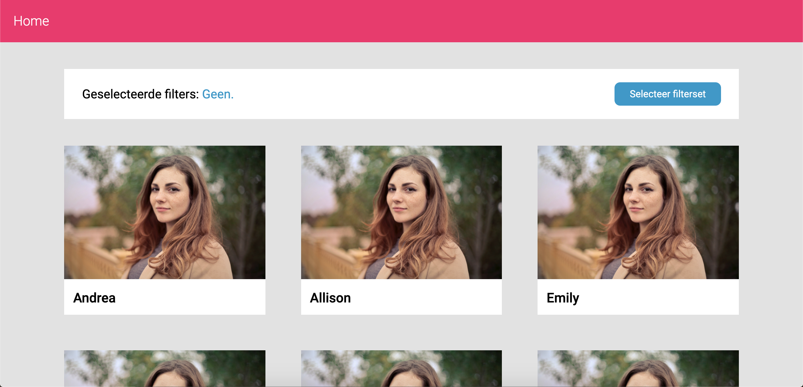

# Project-tech

Welkom bij mijn repository van blok tech. In deze repository is mijn feature voor dit project te vinden. In mijn wiki heb ik mijn onderzoek gedocumenteerd.



## Feature
Mijn feature is een filterfeature. De gebruiker kan een filterset aanmaken via een formulier. Deze komt op de favorieten filtersets te staan, vervolgens is het de bedoeling dat de gebruiker een van deze filtersets kan selecteren, aanpassen of verwijderen.

## Gebruikte pakketen
* `express`: om mijn server op te zetten.
* `ejs`: als templating engine.
* `body-parser`: om data uit een request body te halen en op te slaan in een array.
* `dotenv`: om gevoelige informatie op te slaan in een apart bestand.
* `express-session`: om data op te slaan in een session.
* `mongodb`: om te verbinden met een database.

Verder gebruik ik nog:
* `eslint`: om mijn code te linten.
* `nodemon`: zorgt ervoor dat de server zelf opnieuw opstart na een code wijziging.

## Intallatie guide
To install, clone this repo. Navigate to the folder in your terminal and:
```
$ npm install
```

## Gebruikte bronnen
Installeren npm en packages:  
https://www.youtube.com/watch?v=tdqXTNqNrr0  

Installatie Express:  
https://expressjs.com/  

Static files in express:  
https://expressjs.com/en/starter/static-files.html  
https://stackabuse.com/serving-static-files-with-node-and-express-js/  

Aanmaken van routes:  
https://expressjs.com/en/guide/routing.html  

Templating engine:  
https://ejs.co/#install  
https://ejs.co/#features  
https://expressjs.com/en/guide/using-template-engines.html  
https://www.youtube.com/watch?v=VM-2xSaDxJc  

Installeren body-parser:  
https://www.npmjs.com/package/body-parser  

Opzetten Mongo Atlas:  
https://docs.atlas.mongodb.com/getting-started/  

Verbinden met mongodb:  
https://docs.mongodb.com/guides/server/drivers/  

Werken met mongodb:  
https://docs.mongodb.com/manual/reference/method/db.collection.find/  
https://examples.javacodegeeks.com/software-development/mongodb/mongodb-toarray-example/  
https://docs.mongodb.com/guides/server/insert/  

Sessions:  
https://www.npmjs.com/package/express-session  
